# Auditing and Membership Inference (April 14)

## [Membership Inference Attacks against Machine Learning Models](https://arxiv.org/abs/1610.05820)

### Introduction and Motivations

Machine learning (ML) has become a cornerstone of modern technology from image and speech recognition to natural language processing and recommendation systems. In today’s data driven world, organizations routinely leverage ML to extract insights, optimize services, and enhance user experience. However, the widespread deployment of ML models also brings into question privacy concerns regarding the inadvertent leak of sensitive information about training data. Information leaks can occur at both the population and the individual record levels. "Membership Inference Attacks Against Machine Learning Models" focuses on information leakage at the individual record level: Given a data record and black-box access to a trained model, the authors ask if an adversary is able to determine if that record was part of the model’s training dataset? 

The motivation to study membership inference attacks arises from the tension between model utility and privacy. On one hand, models must capture enough complexity to provide accurate predictions and generalize well. On the other hand, achieving high accuracy often involves overfitting, to some degree, which is found here to inadvertently increase the risk of leaking membership information. To understand the risks associated with successful membership inference attacks, the authors highlight a few scenarios: 

- Sensitive Data: In a situation where a machine learning model is trained on sensitive data, such as clinical records to predict disease outcomes, an adversary capable of determining if a specific patient's record was used during training could learn that a patient has a particular condition. 
- Machine Learning as a Service (MLaaS) Platforms: With the rise of MLaaS platforms, many organizations deploy models without full transparency into the underlying training processes or regularization techniques. As these services operate as black boxes, any unintended overfitting or leakage becomes even more critical. An adversary with black-box access could exploit subtle differences in model behavior to infer the presence of specific records in the training dataset.

### Methods
#### Attack Overview
The membership inference attack exploits the observation that machine learning models tend to behave differently on data points that were part of their training set versus those that the model has never seen in training. This discrepancy is often, though not exclusively, due to overfitting.

Given a target model $f_{target}$ with a private training dataset $D^{target}_{train} = \{(x_i^{target}, y_i^{target})\}$, where $x_i^{target}$ is an input and $y_i^{target} \in \{1, \ldots, c_{target}\}$ is its true label, the attacker's goal is to construct an attack model $f_{attack}$ that, given a data record $x$ along with the target model’s output probability vector $\mathbf{y} = f_{target}(x)$ with $\mathbf{y} \in [0, 1]^{c_{target}}$ and $\sum_{j=1}^{c_{target}} y_j = 1$, can decide whether $x$ was a member of $D^{target}_{train}$.

#### Attack Model Structure: 
The attack model is composed of a collection of binary classifiers, one per output class of $f_{target}$. Each classifier receives as input the tuple $(x_{attack}, \mathbf{y}, y)$ where $y$ is the true label of $x$, and outputs the membership probability $\Pr\{ (x,y) \in D^{target}_{train} \}, $ indicating whether $x$ belongs to the training dataset of $f_{target}$. Because the distribution of confidence values in $\mathbf{y}$ is highly dependent on the true class $y$, partitioning the attack into $c_{target}$ submodels increases overall accuracy.

#### Shadow Models
To train $f_{attack}$ without direct knowledge of $D^{target}_{train}$ or $f_{target}$’s internal parameters, $k$ shadow models $f_{shadow}^{(i)}$, for $i = 1, 2, \ldots, k$ are built. Each shadow model is trained on its own dataset $D^{shadow}_{train}, i$ that is of the same format and drawn from a distribution similar to that of the target model’s training data. For all $i$, it is enforced that $D^{shadow}_{train}$ and $D^{target}_{train}$ are disjoint, the worst-case scenario for the attacker. If overlap occurred, the attack could perform even better.

Training Scenarios: 
- In some scenarios where the target model’s training algorithm and structure are known (e.g., neural networks, SVM, logistic regression), shadow models can be built accordingly.
- In a Machine Learning as a Service (MLaaS) context, where the target model’s details are hidden, the attacker employs the same service (e.g., via Google Prediction API) to train the shadow models.

Regardless of the training scenario, the greater the number of shadow models $k$, the more training examples are available for $f_{attack}$, improving its accuracy.

#### Generating Training Data for Shadow Models
To mimic the behavior of $f_{target}$, the attacker must generate training data for the shadow models that is statistically similar to the target’s training data. Three methods are proposed for generating such data:

##### Model-Based Synthesis: 
If the attacker lacks real training data or statistical information, synthetic data can be generated by leveraging the target model. The intuition is that records classified with high confidence by $f_{target}$ are statistically similar to the training data. The process is summarized below: 
- Fix a target class $c$ and randomly initialize a record $x$ by sampling each feature uniformly from its possible values.
- Iteratively propose modifications to $x$ by altering $k$ features. Let $x^*$ be the current best candidate and $y_c^*$ be its confidence for class $c$. For each new candidate $x'$, query the target model to obtain $y' = f_{target}(x')$ and accept $x'$ if $y'_c \geq y_c^*$
- When a candidate record $x$ satisfies $y_c > \text{conf}_{\min}$ and $c = \arg\max(y)$, select $x$ with probability $y^*_c$.

Please reference the paper for pseudocode on the synthesis algorithm.

##### Statistics-Based Synthesis
If the attacker has knowledge of the marginal distributions of the features, synthetic records can be generated by sampling each feature independently according to its marginal distribution. 

##### Noisy Real Data
In cases where the attacker has access to data that is similar, but not identical, to the target training data (a "noisy" version), they can simulate realistic conditions. For example, with location datasets, flipping a fixed percentage (e.g., 10–20%) of binary feature values produces a dataset that reflects potential noise in real-world scenarios.

#### Training the Attack Model
For each shadow model $f_{shadow}^{(i)}$
   - Query the model with all records from its training dataset $D^{shadow}_{train}, i$ to obtain prediction vectors and label these outputs as “in” (in training dataset)
   - Query the model with a separate test set $D^{shadow}_{test}, i$ (disjoint from the training set) and label these outputs as “out” (not in training dataset)

Once the membership labels have been generated for the training data, form the attack training dataset $D_{train}^{attack}$ by combining the tuples $( \mathbf{y}, y, membership)$ where $\mathbf{y} = f_{shadow}^{(i)}(x)$ and “membership” is set to “in” if $x \in D^{shadow}_{train}, i$ and “out” otherwise.

Since the distribution of the prediction vector $\mathbf{y}$ is highly dependent on the true label $y$, $D_{train}^{attack}$ is partitioned into $c_{target}$ subsets. For each class $y$, we train a dedicated binary classifier that, given $(\mathbf{y}, y)$, predicts whether $x$ was in the corresponding training set. The attack model $f_{attack}$ is a binary classifier whose output is $f_{attack}(\mathbf{y}, y) \in \{in,out\}$. 

One thing to point out is that when using the aforementioned model-based synthesis, all of the data used for training the attack model is classified by the target model with high confidence. Initially this sounded to me like the attack model was simply learning to recognize records that are classified with a high confidence, but the records used in shadow model training datasets AND the records used in the test set were classified by the target model with high confidence. 

To summarize, the method outlined transforms the complex task of inferring membership into a standard binary classification problem.

#### Experimental Setup

##### Data
The membership inference attacks are evaluated on a diverse set of datasets with different sizes, features, and classification tasks. Below is a brief summary of each: 
- CIFAR-10 & CIFAR-100: Two benchmark image recognition datasets containing 10 and 100 classes with 6,000 and 600 images per class, respectively. 
- Purchases: Simplified shopping histories with 197,324 records. Each record is represented as a 600-dimensional binary feature vector indicating whether a user purchased a specific product. The researchers cluster the records into a varying number of classes for different experiments.
- Locations: The dataset comprises 5,010 user profiles, each characterized by 446 binary features representing visits to different geographical regions or location types. The classification task is defined by clustering the user profiles into 30 distinct geosocial types.
- Texas Hospital Stays: Based on Texas Department of State Health Services’ Hospital Discharge Data, this dataset includes 67,330 records with 6,170 binary features. The classification task predicts the patient’s primary procedure from among the 100 most frequent procedures.
- MNIST: Contains 70,000 handwritten digit images. Classification is mapping the image to the true digit.
- UCI Adult (Census Income): 48,842 records with 14 attributes, such as age, education, occupation, and native country. The binary classification task is to predict whether an individual earns over \$50K per year. 

##### Target Models

We evaluate our membership inference attack against two MLaaS models and one neural network implementation for the local model, all of which are treated as black boxes by the attacker.

MLaaS:
- Google Prediction API: The target model is trained by uploading the dataset to the API, which returns a query interface for the resulting model. There are no configurable parameters and the internal model details remain hidden.
- Amazon ML: The target model is trained using the user’s dataset with limited control over metaparameters. Only the epochs and amount of L2 regularization is varied in the experiments to influence the model’s convergence and degree of overfitting.

Local Implementation:
- A convolutional neural network (CNN) is used for the CIFAR datasets with two convolution-max pooling layers, followed by a fully connected layer of 128 units and a SoftMax output layer. The Tanh activation function is used, with training parameters set to a learning rate of 0.001, decay of $1 * 10^{-7}$, and a maximum of 100 epochs.
- For the purchase dataset, the local target model is a fully connected neural network with one hidden layer of size 128 and a SoftMax layer. Similar training parameters are used with a higher maximum epoch count of 200.

##### Experiments

The training and test sets for each target and shadow model are randomly selected from the respective datasets. These sets are of equal size and are mutually disjoint. There is no overlap between the datasets used for the target model and those used for the shadow models. However, datasets for different shadow models may overlap. The size of the training set is fixed for each dataset except for CIFAR, where multiple training set sizes are evaluated to understand the effect of dataset size on attack performance. 

The number of shadow models is chosen based on the dataset and computational considerations. These shadow models are trained using the same configuration as the target models on the respective shadow training datasets as a proxy to approximate the behavior of the target model. For datasets such as purchases, where target models are built using multiple platforms (Google, Amazon, and local neural networks), the same training dataset is used. This controlled setup allows for direct comparison of the membership leakage across different model platforms. The attack model is trained using similar architectures across platforms to ensure consistency in the attack’s evaluation.

The membership inference attacks are evaluated using precision and recall, standard metrics for binary classification. Precision is defined as the fraction of records that the attack model infers as members which are truly members of the training dataset. Recall measures the fraction of actual training records that the attack model correctly identifies as members. These metrics are computed per class and averaged to assess overall attack performance, with a baseline accuracy of 0.5 when the numbers of members and non-members are equal (equivalent to random guessing).

### Results and Key Findings
#### Overall Attack Accuracy

The primary goal of the attack is to determine if a record belongs to the target model’s training dataset. Across multiple datasets and configurations, the attack significantly outperforms random guessing. In the CIFAR datasets, the target neural network model trained on CIFAR-10 (15,000 training records) and CIFAR-100 (29,540 training records) achieved poor test accuracies of 0.6 and 0.2, respectively, indicating heavy overfitting. The attack, however, achieved an average precision of $0.74$ and $0.988$, respectively. For a Google-trained model on the Texas Hospital dataset, with training and test accuracies of 0.66 and 0.51 respectively, membership inference precision was mostly above 0.6 and exceeded 0.85 for over 20 classes. Results were similar for a Google-trained target on the Location dataset with a perfect training accuracy and 0.66 test accuracy, the attack’s precision ranged between 0.6 and 0.8 with almost constant recall of 1.

These findings confirm that when the target model is overfitted, its behavior on training data is noticeably distinct from that on unseen data, enabling effective membership inference.

#### Comparison Across Platforms
When evaluating models built using different machine learning platforms, it is observed that Google’s service typically exhibit the highest information leakage. For example, on the purchase dataset with 100 classes, the attack precision reached 0.935. The Amazon-trained models showed lower leakage compared to Google: Precision values on the purchase dataset were 0.505 and 0.935 for the two configurations, respectively, indicating that even modest adjustments in hyperparameters can influence the degree of leakage. In the controlled experiments with local models, the attack also achieved strong performance, although the leakage patterns sometimes differed from the cloud services, reflecting differences in model architecture and training procedures.

Figure 7 provides a comparative visualization of the attack precision across these platforms.

  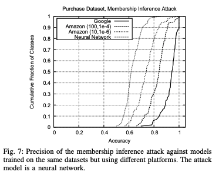

#### Effect of Shadow Training Data Quality
The quality of shadow model training data is critical. Experimenting with several data generation methods, results show shadow models trained on the real data (location dataset) had an attack precision around 0.678. With 10% and 20% noise introduced into the shadow data, precision dropped slightly to 0.666 and 0.613 respectively . Despite the noise, the attack remains robust, demonstrating its effectiveness even when the attacker's assumptions about the target data distribution are not perfectly accurate.

When no real data was available and synthetic data is generated for the shadow models using marginal statistics and a model-based synthesis approach, results were also positive. For the purchase dataset, marginal-based synthetic data yielded an overall precision of 0.795. Moreover, model-based synthetic data achieved precision of 0.896 for most classes, though some underepresented classes suffered with precision below 0.1 (see Figure 9).

  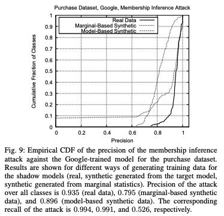

These results underscore that while training on high-quality real data produces the best results, the attack is still effective with synthetic or noisy data.

#### Influence of Number of Classes and Training Data Distribution
The attack’s accuracy is strongly influenced by the number of classes in the target model and the distribution of training data. 

Models with a larger number of classes, such as CIFAR-100 or purchase datasets with 100 classes, leak more information. For example, as illustrated in Figure 10, increasing the number of classes from $2$ to $100$ for the purchase dataset results in a marked increase in attack precision from $0.505$ to $0.935$.
  
Further, Figure 11 shows that classes with more training data tend to exhibit lower attack precision, whereas classes with few training records (sometimes less than 30 per class) are highly vulnerable. This is because the target classifier is less confident in modeling underepresented classes, making membership status more discernible.

  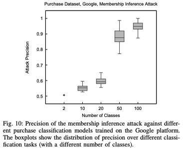

  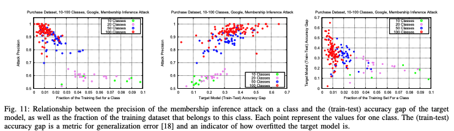

#### Role of Overfitting
Overfitting is a key driver of membership leakage. There is a strong correlation between the train-test accuracy gap and the success of the attack. Larger gaps, which indicate heavy overfitting, are consistently associated with higher attack precision (Figure 11). 

It is important to note, however, that when two models exhibit similar levels of overfitting, differences in architecture and training procedures can still result in different leakage levels. For instance, Google-trained models leak more than Amazon-trained ones despite having better generalizability in some cases.

#### Mitigations
Success of membership inference is inherently tied to the generalizability of the model and the diversity of its training data. Overfitting and poor generalization result in information leakage. Overfitting, however, is a common problem in any machine learning setting. As a result, the usual tradeoff between utility and privacy does not apply in this attack setting. Instead, regularization techniques can help aid in reducing overfitting and strengthening privacy guarentees in neural networks. Some methods of regularizing the model include $1)$ Top-k filtering restricts the prediction vector to the top $k$ classes and limits the detailed information available to an attacker; $2)$ Coarsening prediction precision by rounding the probabilities to fewer digits to reduce the fine-grained information in the output; $3)$ Increasing the temperature parameter $t$ in the softmax layer produces a flatter probability distribution, thereby increasing entropy and making the model’s output less informative for membership inference; and $4)$ Adding an L2 penalty $\lambda \sum \theta_i^2$ to the loss function to reduce overfitting, improving generalization while also reducing leakage. 

The Purchase and Texas hospital stay datasets (each with 100 classes), were used to evaluate the effectiveness of each mitigation strategy and are outlined in Table III below. Overall, these strategies slightly reduce the risk of leakage without drastically compromising the utility of the target models. 

  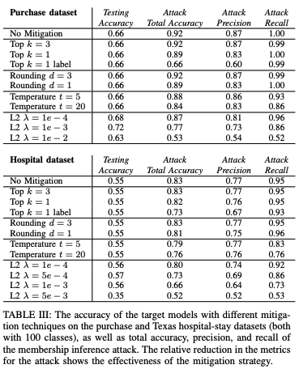

### Critical Analysis

#### Strengths
In complete honesty, I was not the biggest fan of Membership Inference Attacks in Machine Learning Models. I think the largest strength of the paper was purely their contribution to the field. They develop an attack framework and create a metric to quantify membership leakage in models. This serves as a valuable tool for assessing and improving privacy protection, specifically regarding membership inference attacks, in machine learning system. 

In terms of the actual experimental setup and paper, I think the description of the attack setting and motivations for design choices were abundantly clear, particularly the discussion of MLaaS and how large corporation are producing models for production settings that might be vulnerable.

#### Weaknesses
The weaknesses of this paper were a little bit easier to formulate. While I give credit to the attack setting and motivations, I think the experimental setup was a little too diverse. Most of the time when critically evaluating papers people mention extensive and diverse tests would benefit the argument. I found the opposite to be true for this paper. By using so many datasets and model configurations/architectures, I found it hard (at times) to fully grasp results. I know some figures are excluded for brevity, but the explanation of results sometimes felt a little sparse, hard to follow, and potentially even hand picked (ex. lack of train-test accuracy with regularization techniques figure). 

A particular irritant I had included a lack of discussion regarding the cost of running the attack. More specifically, when querying the victim model in model-based data synthesis, the authors mention needing 156 querries on average for each sample. They discuss it costing money to query models through Amazon and Google's APIs, so at some point I assume the attack is not feasible if it costs too much (or even if the computational complexity is too high). 

#### Potential Biases
There are not many issues of bias that I see in this paper. I think the diverse set of datasets and model architectures/configuration did a sufficient job in covering most attack settings. If I had to try and identify some the way the datasets are processed (e.g., clustering purchase records or filtering Foursquare check-in data) could have introduced bias. Synthetic data for shadow models could also introduce bias if the authors do not adequately capture the true underlying distribution of the target model’s training data, but this was addressed in the test that added noise to the real data.

#### Ethical Considerations

The paper explicitly shows that membership inference attacks can reveal whether an individual’s data was part of a training set. In contexts like healthcare (e.g., hospital discharge data), this could indirectly disclose sensitive information about a person’s health status. As with any research paper in privacy, security or model robustness, the research could be misused by malicious actors to compromise the privacy of individuals in deployed systems. In line with this thinking, there are ethical considerations in terms of informing machine learning service providers like Google and Amazon about vulnerabilities so that they can be fixed exploited.

## [Membership Inference Attacks From First Principles](https://arxiv.org/abs/2112.03570)

Full Citation: Carlini, Nicholas, Steve Chien, Milad Nasr, Shuang Song, Andreas Terzis, and Florian Tramer. “Membership Inference Attacks From First Principles,” 2022. https://arxiv.org/abs/2112.03570.

### Introduction and Motivations

Past work investigating membership inference attacks (MIAs) has mainly measured attacks’ successes by averaging over examples, but this method does not capture important nuances on the example-level that may distinguish some attacks as more successful than others. This is because models’ decisions on different examples may reflect different levels of model competency that are lost through averaging. To account for this, the authors propose a new metric for measuring the effectiveness of a MIA on a model: measuring the true positive rate (TPR) at a low false positive rate (FPR). The intuition is that attacks are most effective when they reliably identify examples from the data as training examples while rarely or never mistaking non-training examples for training examples, even if they can only reliably identify a small portion of examples (because this means they have still succeeded at recovering private information from the training data). For example, the authors explain that an attack might not be affected if it uncovers many false negatives because this means it simply may not have been able to identify them as training examples, but an attack that uncovers many false positives would be more concerning because it may be less trustworthy when it labels an example as being from the training data. Their proposed evaluation metric aims to take into account the differences between these different types of examples. It is also advantageous in that TPR and FPR can be calculated without knowing exactly how many datapoints of a specific type are in the dataset. The authors then develop a new attack, which they call the Likelihood Ratio Attack (LiRA), and demonstrate the effectiveness of this attack over other methods using this evaluation framework. 

### Methods

The authors use a simple attack called the LOSS attack as a baseline to compare the performance of their proposed attack against. The LOSS attack takes the loss of a particular datapoint and, if the loss is relatively high (according to some threshold) the example is labeled as not being a member of the training data. Otherwise, examples with lower losses are assumed to be members of the training data. While this attack achieves good accuracy on an image classification model trained by the authors, they find that the attack was good at identifying examples with high loss that the model was **not** trained on, but it was not good at identifying examples with low loss that the model was trained on. 

To visualize the relationship between an attack’s TPR and FPR following their proposed method, the authors plot ROC curves (different from ROC-AUC, which averages over datapoints. This average becomes less meaningful as the FPR gets higher). The following ROC curves demonstrate that the LOSS attack does not achieve a high TPR at acceptably low FPRs:

<figure>
    
    <figcaption>LOSS Attack's Performance Under the Proposed Evaluation Method (Carlini et al., (2022), Figure 2, page 4)</figcaption>
</figure>

The authors propose a new type of attack based on using TPR and FPR to measure attack success, which they call the Likelihood Ratio Attack (LiRA):

First, they train shadow models on the datapoints, where for a given datapoint half of models were trained on it (this constitutes the “in” distribution of models) and half of models weren’t trained on it (this constitutes the “out” distribution of models).

They then perform a Likelihood-ratio test to determine the chance that a given datapoint was in the training set or not (using the probability density function), as pictured in the figure below:

<figure>
    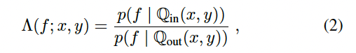
    <figcaption>The Likelihood-ratio test (Carlini et al., (2022), Equation 2, page 4)</figcaption>
</figure>

This formulation, however, has to be altered in order to be useful in practice for this work. First, you cannot actually compute the distributions in the equation above as-is, so instead the authors use, for each “in” and “out” distribution of models, the model losses for a particular example:

<figure>
    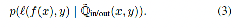
    <figcaption>Using model losses to model their distributions (Carlini et al., (2022), Equation 3, page 4)</figcaption>
</figure>

Additionally, without knowing the distribution to be estimated by the shadow models it may take many models to approximate it correctly. Therefore, to simplify the computation and reduce the number of shadow models needed, the authors assume that each distribution of models is Gaussian. The authors also scale the model loss/confidence outputs to approximate a Gaussian distribution, since these values do not follow a normal distribution inherently. They apply such “Logit Scaling” as follows:

<figure>
    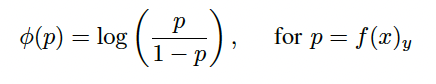
    <figcaption>Logit Scaling (Carlini et al., (2022), page 5)</figcaption>
</figure>

Using both the “in” and “out” distributions of models as described above, the authors construct an online attack that trains both “in” and “out” models and estimates the mean and variances of the (approximated) Gaussian distribution of confidences, outlined in the following algorithm:

<figure>
    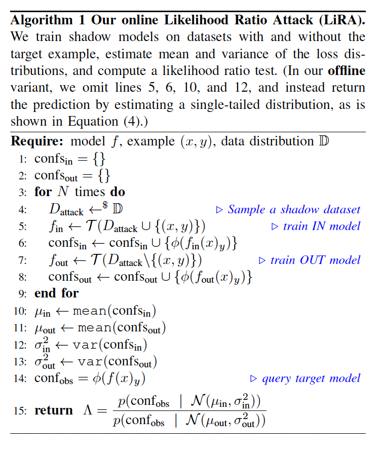
    <figcaption>Online Attack Algorithm (Carlini et al., (2022), Algorithm 1, page 6)</figcaption>
</figure>

They also employ an offline attack, which follows the procedure of the online attack except that it only trains “out” models. Then, for a particular datapoint, the distribution of model confidences on this datapoint is compared to the normal distribution approximated by the models during training. The larger the distribution of model confidences is compared to the approximated distribution, the likelier it is that the datapoint in question is a member of the training data. This evaluation criteria is formalized as:

<figure>
    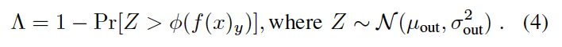
    <figcaption>Offline Attack Output (Carlini et al., (2022), Equation 4, page 6)</figcaption>
</figure>

To improve performance, the authors also query multiple datapoint augmentations (here, image augmentations) in their attack in an attempt to improve accuracy.

Additionally, the authors test the performance of attacks from prior work using their new TPR at small FPR metric and test their attack on models pretrained by others. Finally, they perform an ablation study to analyze the effectiveness of different parts of their attack. These results are described in the following section.

### Key Findings

#### Offline vs Online Attack Methods

Overall, the performance of the online and offline attack methods were similar when tested on models trained on various image datasets as well as one text-based model. The image below displays these results, with the results from the online attack (Figure 5) on the left and the results from the offline attack (Figure 6) on the right:

<figure>
    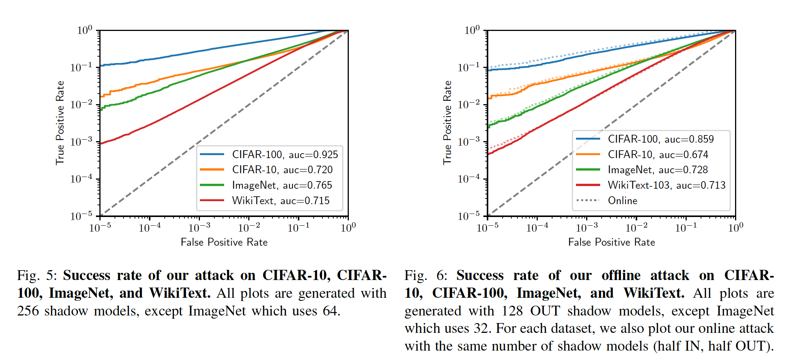
    <figcaption>Online Attack (left, Figure 5) vs Offline Attack (right, Figure 6) (Carlini et al., (2022), Figures 5 and 6, page 7)</figcaption>
</figure>

#### Scoring Prior Work Using the Proposed TPR at low FPR Method:

Despite some prior membership inference attacks doing worse than others when measured using accuracy, some of these attacks actually performed better when measured using the TPR/FPR method. This suggests that attacks previously thought to be ineffective may actually be more robust than other attacks thought to be stronger, in particular Sablayrolles et. al and Watson et al. from the following table:

<figure>
    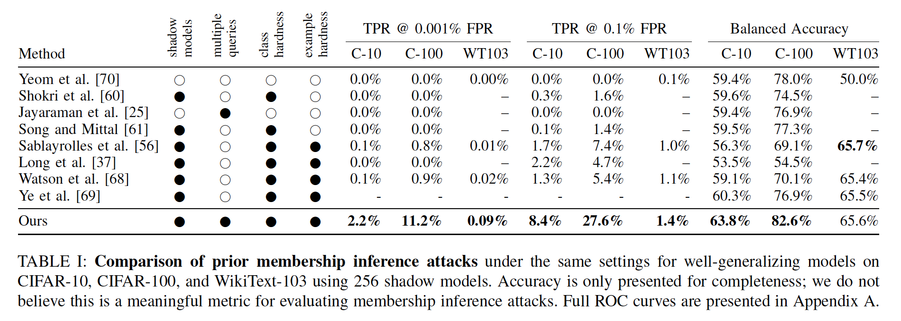
    <figcaption>Scoring past work with the newly proposed TPR/FPR method (Carlini et al., (2022), Table I, page 8)</figcaption>
</figure>

#### Testing the LiRA Attack on Previously Pretrained Models

After testing their attack on pretrained models from prior work, the authors find that their attack is effective against these models:

<figure>
    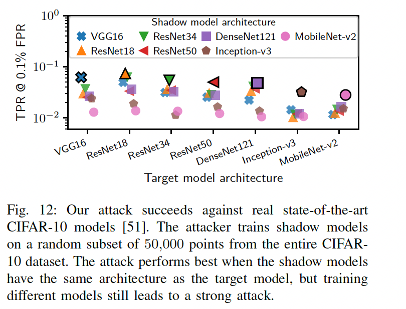
    <figcaption>Testing the proposed attack on other pretrained models (Carlini et al., (2022), Figure 12, page 12)</figcaption>
</figure>

#### Datapoint Privacy

One interesting result the authors observe is that examples that are more out of a model’s distribution are more easily detectable. The figure below demonstrates that randomly labeled images (which are more likely to be out of distribution if the labels are not the expected class) are more easily detectable (as demonstrated by distributions of higher privacy scores (e.g., detectability)):

<figure>
    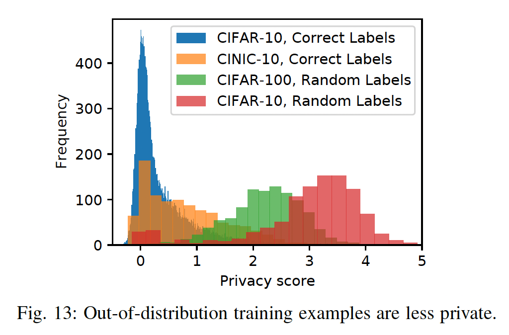
    <figcaption>Out-of-distribution datapoints are more detectable (Carlini et al., (2022), Figure 13, page 13)</figcaption>
</figure>

#### Ablation Study

The authors test the effects of five different components of their attack:
1. Logit scaling (transforming loss/confidence values to follow a Gaussian distribution)
2. Number of shadow models used
3. Querying on augmented data
4. Data overlap between shadow models and the model being attacked
5. Differences in architecture/hyperparameters between shadow models and the model being attacked

They find that:

1. Their method of logit scaling performs best out of other methods they try:

<figure>
    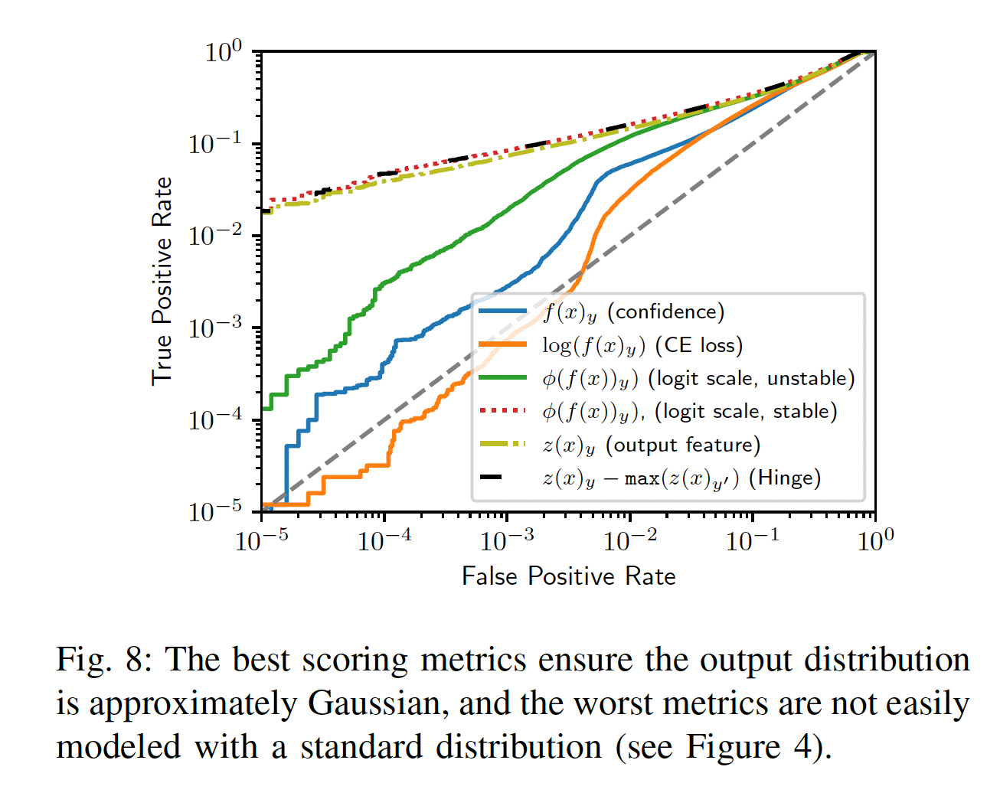
    <figcaption>Logit Scaling Ablation (Carlini et al., (2022), Figure 8, page 10)</figcaption>
</figure>

2. Training too few shadow models reduces performance, but training too many shadow models also reduces performance. Also, computing variance globally works better when there are not as many shadow models:

<figure>
    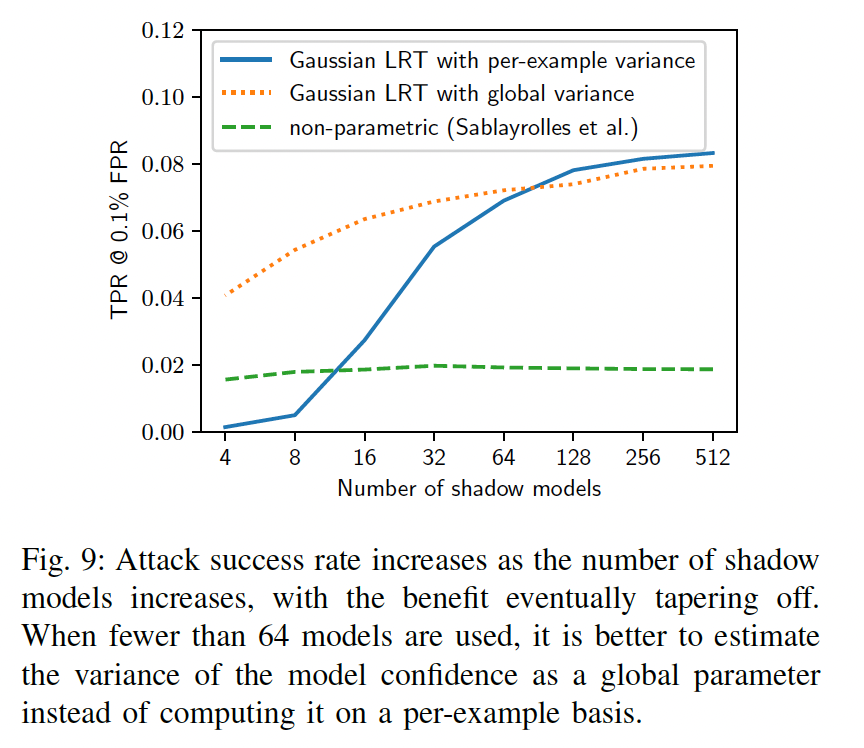
    <figcaption>Number of Shadow Models Ablation (Carlini et al., (2022), Figure 9, page 10)</figcaption>
</figure>

3. Querying on augmented datapoints improves performance:

<figure>
    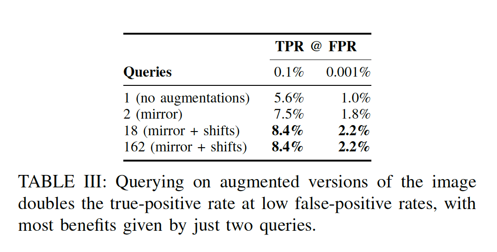
    <figcaption>Querying Augmented Data Ablation (Carlini et al., (2022), Table III, page 11)</figcaption>
</figure>

4. While the original experiments included some data overlap between shadow models and the model being attacked, having no overlap doesn’t change performance by much. However, if the data used for the shadow models and model being attacked do not all come from the same distribution, performance drops:

<figure>
    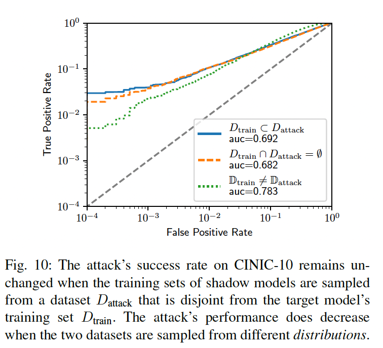
    <figcaption>Data Overlap Ablation (Carlini et al., (2022), Figure 10, page 11)</figcaption>
</figure>

5. If the adversary doesn’t know the model architecture, their attack can still do well by training shadow models on a different architecture, though not as well as if they were trained on the same architecture as the model being attacked. Attacks can also succeed across different optimizers if the adversary chooses a different one than the one used to train the model being attacked. It is most important, however, for the adversary to use the same data augmentations used when training the model being attacked, because not doing so will lead to a drop in performance:

<figure>
    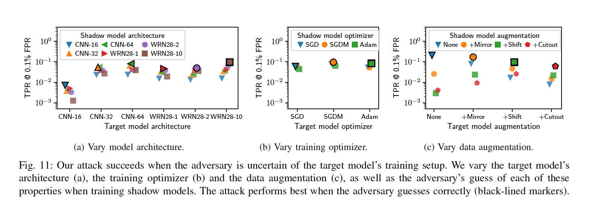
    <figcaption>Architecture and Hyperparameters Ablation (Carlini et al., (2022), Figure 11, page 12)</figcaption>
</figure>

### Critical Analysis 

#### Strengths
This paper highlights the importance of reliable and informed evaluation metrics alongside model testing and development. If the evaluation metric used to measure a model's performance, safety, privacy, robusteness, etc. is itself not reliable, our knowledge of the reliableness of a proposed method drops. The paper was very throrough in exploring different angles important to the effectiveness of the proposed metric and the proposed attack — for example, testing prior attacks on their new metric, testing their attack on models from prior work, and testing both text and image models in their experiments. By revealing that not all datapoints are equal in their effect on an attack, this paper opens avenues for future work into designing attacks and evaluation metrics that capture more of the nuances in individual datapoints that affect attack performance.

#### Weaknesses
Though the authors' decision to assume the distributions of "in" and "out" models are Gaussian makes sense with respect to reducing the number of shadow models needed, it may have been interesting to attempt to empirically approximate the models' distributions without assuming they were Gaussian to get a sense of how many models would be needed, what performance was like, and how these results compared to the results found when Gaussian distributions were assumed.

Additionally, the authors offer preliminary evidence that using DP-SGD may hinder their attack performance, which suggests that their attack may not be robust in all privacy scenarios (p16). Though this is a weakness of the attack, it sets the stage for future research into developments of more robust attacks (followed, hopefully, by more robust defenses).

One weakness the authors cite is the fact that while their attack is effective, it is not the most computationationally efficient. While this is true, I would argue that unless the attack is impossibly slow (for example, taking years to run), computational efficiency need not be the "make or break" factor of an attack if, in the average case, the attack can succeed at exposing private information even if it takes a bit longer to run. Since the attack succeeds if it reveals even a small amount of private information, taking a bit longer to run might be less of a concern in this case. However, there is no doubt that faster attacks that maintain/exceed current attack accuracy would be more dangerous, particularly if they could be run multiple times to find more and more private information over time.

#### Potential Biases

Given that the authors find that out-of-distribution data is more likely to be detected by an attack, this highlights the importance of protecting datapoints that are not very common in the training data and/or do not follow the distributiona as closely as others, which could represent data from people from marginalized groups or who aren't very well-represented. This emphasizes the importance of protecting less frequently observed instances in the training data, as these instances may be more vulnerable to attacks simply because they follow the oveall distribution less closely.

#### Ethical Considerations

Research into membeship inference attacks is delicate because, on one hand, developing new attacks and evaluation metrics allows researchers to develop adequate defenses to these attacks (and methods of measuring them) but on the other, risks introducing new attack methods without any robust defense mechanisms to complement them. An ethical approach to this work, then, may involve doing some extra work to suggest future avenues of research to develop defenses for any proposed attacks. This paper does this is a couple of ways: first, the authors tested how vulnerable datapoints that were in or out of distribution were to attacks using their "Privacy Score". Although this is not a proposal for a defense mechanism, it does provide insight that may be helfpul in the development of future defenses. In addition, the authors offer preliminary evidence that using DP-SGD hinders their attack performance, which is another step they take to open avenues for future work in defenses to these attacks.

## [The Secret Sharer: Evaluating and Testing Unintended Memorization in Neural Networks](https://arxiv.org/abs/1802.08232)

### Introduction and Motivation

Recent advancements have brought rise to neural networks. Neural networks have become incredibly powerful tools in a variety of tasks such as text generation, translation, and even predictive typing. Despite the power they wield, there is a bit of responsibility that comes with it as these models are trained on sensitive user data. In this paper, titled The Secret Sharer, Carlini et al. explore a significant issue that is often overlooked: neural networks unintentionally memorizing sensitive data. This can include access to secrets like social security numbers, credit card numbers, or even confidential business information which appears even once in the training data. In this paper, the authors propose a systematic testing methodology to best detect this type of memorization and introduce a metric known as the "exposure" metrics as a method of quantifying risk. The approach in this paper was even utilized to improve privacy in a real-world setting through Google's Smart Compose system.

### Methodology

#### What Is Unintended Memorization?

Unintended memorization refers to when models learn and can later reproduce rare or unique training data, even if the data isn't useful for the task in question. For example, if a user's email content included something along the lines of "My social security number is 078-06-1130", then a well trained generative model could potentially auto-complete prompts of a similar nature with the exact number - even when it fundamentally shouldn't.

This issue becomes particularly alarming in the context of language models are they are trained on private or sensitive user data like emails, chat logs, or customer service transcripts. The thing with these model is that they are designed to identify and mimic patterns in natural language - but sometimes, they learn too well. In the case where a unique sequence appears only once in the training data or even a handful of time, and the model is still able to recall and regenerate it, it indicates a failure of generalization and a breach of privacy.

What makes this problem especially difficult to manage is that memorization is often unidentified during testing. Traditional standard metrics like validation loss or test accuracy don't reveal whether this model is regurgitating private data. Furthermore, even if the memorized content is rare, it can easily be extracted by a motivated attacked who uses carefully crafted prompts or prefix-based probing.

But really, the key insight here is that memorization isn't just some quirk, it is a systemic risk in how models are trained. This is especially apparent in large-scale deployments where models learn from billions of tokens as the change that sensitive or identifiable information is memorized and exposed increases drastically.

#### Measuring Memorization: The Exposure Metric

In order to assess this memorization risk, the authors propose a novel metric called exposure. This metric aims to estimate how likely it is that a unique, inserted secret - which they refer to as a canary - can be extracted from a trained model. The exposure score is then computed by comparing the log-perplexity of the canary sequence to that of other randomly generated alternatives from the same format.

In other words, **a high exposure score implies that the model has ranked the canary as more "natural" or likely than many alternatives, indicating that memorization has occurred.**. An exposure score approaching the upper bound (which is determined by the total number of positive canaries) suggests that this model has memorized the canary and that we can likely recover it with a relatively small number of guesses.

For example, the following table shows several candidate canary sequences beside their computed log-perplexities. The true inserted canary ("The random number is 281265017") has the lowest perplexity by a large margin. This means that the model is assign it a much higher likelihood than other plausible scenarios.

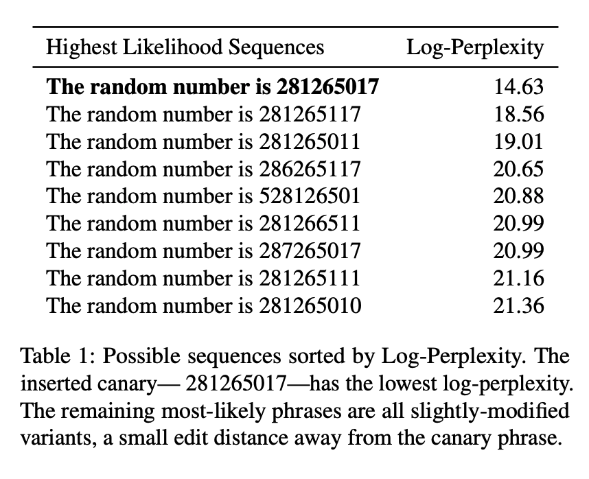

To further validate the effectiveness of exposure, the authors develop a **shortest-path search algorithm** which efficiently extracts canaries from the model by utilizing solely its predicted probabilities (as we can see in the following figure). This algorithm models the search space as a tree of token sequences and traverses it in a way which prioritizes the most likely completions. If we compared this method to brute-force guessing, this method reduces the number of queries by up to **five orders of magnitude**, as illustrated in the following figure.

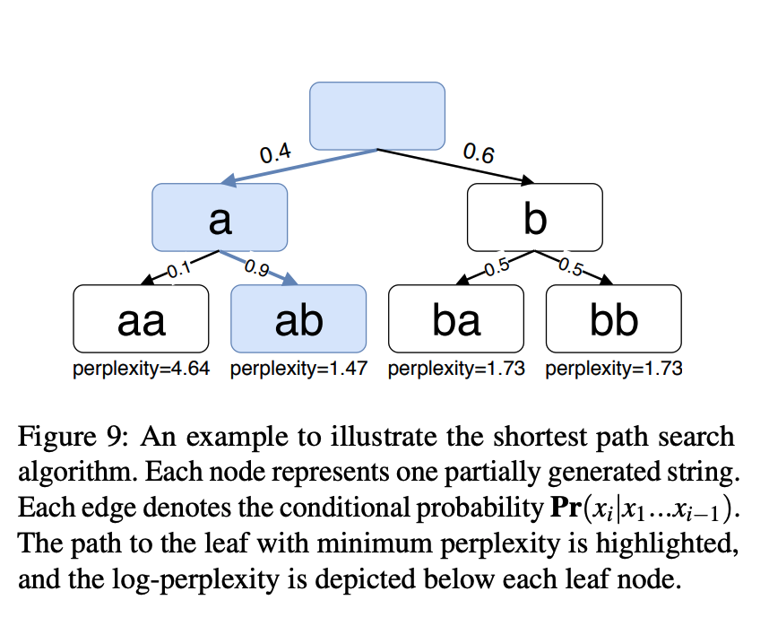

Furthermore, the figure shows that there is a strong correlation between exposure and the success rate of extracting a canary. Once the exposure surpasses a certain threshold (e.g., 33 for a randomness space of size 2^30), then the extraction becomes not only possible but extremely probable.

Because of this framework, researchers and practitioners are able to systematically test for unintended memorization by inserting canaries during training and measuring their exposure afterwards. More importantly, this methodology is model-agnostic and applies to any generative sequence model where the probability scores for sequences can't be computed.

Ultimately, this show exposure metric serves as a powerful-diagnostic tool - one which can uncover serious privacy vulnerabilities even in model which appar performant by conventional evaluation metrics.

### Testing Strategy
The methodology is practical and includes the following:
 - 1. Inserting canary phrases into training data.
 - 2. Training models using different architectures and settings
 - 3. Measuring the exposure of these phrases
 - 4. Validating with extraction algorithms

This methodology was tested across different models and datasets which include the Penn Treebank, WikiText, and even real user emails from the Enron datasets.

### Results

#### Exposure Over Training Time

The results of this paper show that memorization can occur early in training, often before overfitting. In fact, the exposure tends to peak around the epoch where the validation loss is minimized, not when the overfitting occurs.

#### Differences Across Model Types
- **Character-level models**: These models, often used for fine-grained text generation, begin memorizing early in training, especially when presented with structured numeric sequences like credit card numbers. However, because they work at the character level, they require more training steps or more canary insertions to reach high exposure levels. In one experiment, a canary required 16 insertions before reaching an exposure level of 60 - just short of extractability.
- **Word-Level Language Models**: These models, operating at a coarser granularity, tend to memorize canaries more quickly and more completely. With just 5 insertions of a canary in a world-level model trained on WikiText-103, the exposure soared above 144, well into extractable territory. Despite achieving comparable or better utility than other models, they exhibhited wildly different memorization behaviors depending on training hyperparameters.
- **Neural Machine Translation**: Even models that are designed for translation tasks are not immune to unintended memorization. Using a TensorFlow-based Englisth-to-Vietnamese model, the authors inserted a sentence-level canary ("My social security number is...") into just four training examples - and found that this was enough to fully memorize the phrase. The model assigned such a low perplexity to the inserted sequence that it became trivial to extract.

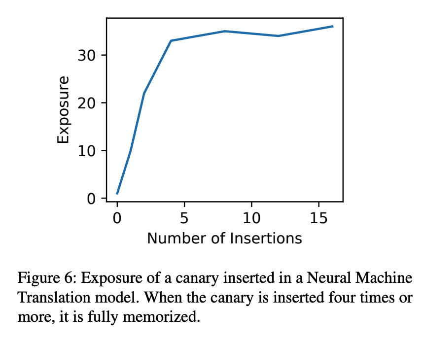

#### Real-World Validation
The authors applies their tests to Smart Compass, a commercial LSM model which is trained on billions of emails. With up to 10,000 canary insertions, the exposure remained low and helped inform privacy safeguards for the deployed system.

The authors also showed that the pre-existing secrets in the Enron email dataset were memorized and could be extracted confirming that this isn't just a synthetic artifact.

### Critical Analysis

#### **Strenghts of the Paper**
- Comprehensive Evaluation: One of the standout strengths of this paper is the sheer breadth of its evaluation. The authors go beyond toy models and academic benchmarks as they systematically test multiple model architectures across a range of real-world datasets, including Penn Treebank, WikiText-103, and the Enron email corpus. This diversity makes the results highly credible and widely applicable. It shows that unintended memorization is not just an isolated phenomenon, but rather one that is a pervasive issue across modern generative models.
- Actionable Metric: Exposure provides a practical way to quantify and test privacy risks
- Effective Attacks: Their shortest-path search algorithm is a major step forward in extractability

#### *Limitations**
- Focus on White-box Assumptions: The extraction techniques assume access to model logits, which might not be realisitc in all cases.
- No New Defense Proposed: While the exposure test is valuable, stronger defenses against memorization are still needed.
- Limited Protection from Common Techniques: Standard methods like dropout, weight decay, and quantization do not prevent memorization

### Conclusion
In conclusion, Carlini et al.'s paper serves as a wake-up call to the deep learning community. The reason being is that it shows unintended memorization is real, quantifiable, and already present in production systems. Their exposure basesd testing methodology and extraction attacks are likely to become standard tools in evaluating privacy risks in generative models. This work also highlights the the importance of differntial privacy, which they found to be the only effective method for completely preventing memorization - though it comes at the cost of some utility. As generative models continue to be adopted in sensitive applicatoins, this paper sets the bar for responsible training and evaluation.

## [Auditing Differentially Private Machine Learning: How Private is Private SGD?](https://arxiv.org/abs/2006.07709)

### Introductions and Motivations
Differential privacy techniques are widely used due to their robust, provable guarantees in terms of privacy. Due to the extent to which the learned distribution is shifted, differential privacy is able to provide strong worst-case guarantees in terms of the maximum information gained from a training example. This quantity of information is represented by the privacy parameter $\epsilon$, where a smaller epsilon implies stronger privacy protections, but often results in lower model performance and data utility as the data shifts further from the true distribution. However, in practice, the value of $\epsilon$ is often maximized while providing reasonable privacy guarantees to prevent significant loss in utility. 

In this work, the authors explore the potential for a more fine-tuned method of selecting an $\epsilon$ that appropriately leverages the strong formal protections of differential privacy without the common pitfall of losing such protections in practice with an overly large $\epsilon$. Differential privacy protections are often decided pessimistically, assuming a worst-case in terms of the data and the attacker's abilities. Therefore, this work investigates whether DP-SGD provides better privacy in practice compared to its current theoretical analysis by desiging novel data poisoning attacks that allow an approximation of a more realistic lower bounds on $\epsilon$, relaxing the constraints on the value of $\epsilon$ in practice.  

### Methods

To empirically measure the practical privacy of DP-SGD, the authors first define a metric to represent the amount of privacy protection rather than relying on solely theoretical limits. They design a statistical test to find the lower bound $\epsilon_{LB}$ on the actual privacy loss. This test measures the distinguishability of models trained on two datasets that differ on a small number of examples. By estimating this distinguishability through repeated trials and confidence intervals, $\epsilon_{LB}$ can be computed to be an empirical lower bound.

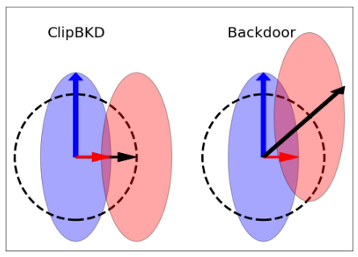

Next, the dataset is constructed using an enhanced version of data poisoning that the authors call ClipBKD. Normally, DP-SGD utilizes gradient clipping, which limits the influence each individual point can have, which can reduce the effectiveness of standard data poisoning attacks. With ClipBKD, the attacker identifies the gradient of least variance, maximizing the distance of poisoning points even with gradient clipping. This is shown in the figure above, where the direction of movement in ClipBKD pushes where variance is the lowest, leading to decreased overlap relative to the new distribution. 

Lastly, the overall experiment is designed to be as standard as possible to ensure the widespread applicability of this auditing framework. The authors select two fairly simple model architectures, a two layer feed-forward neural network and a logistic regression model, with hyperparameters shown in the table below. Hyperparameters were adjusted to ensure that each model retained an accuracy between 96-98% to maintain consistent performance across each setting. These models are evaluated on the Fashion MNIST, CIFAR10, and Purchase100 datasets due to their popularity and simplicity.  

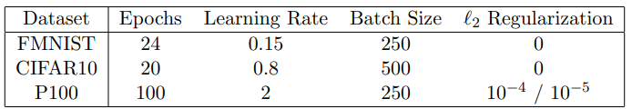

### Key Findings

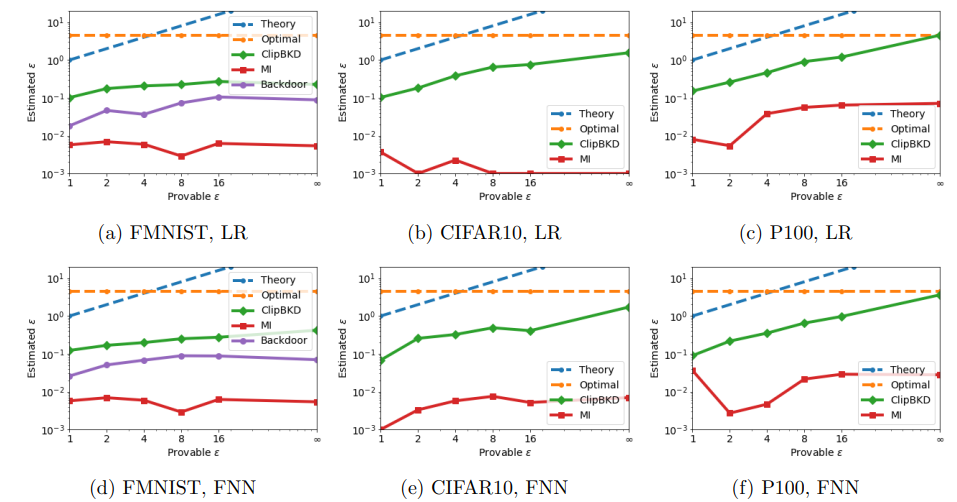

The novel ClipBKD method demonstrates a fairly high success rate relative to the pre-existing attacks. The attack's performance is extremely important within this context as it provides a far better estimate of the $\epsilon$ lower bound. As shown in the graphs above, there is not a significant gap between the theoretical amount of information leakage (blue) and ClipBKD (green). In other words, effective attacks like ClipBKD demonstrate that the gap between the demonstrated lower bound and theoretical upper bound of privacy is shrinking, giving a fairly accurate range between which the true privacy level resides. With this framework, combining theoretical and empirical analyses can tighten the bounds on the level of privacy provided by the techniques implemented. 

### Critical Analysis

#### Strengths
This paper provides a few key contributions towards measuring the protection provided by a privacy technique. The overall framework of combining the theoretical and empirical analyses to demonstrate an upper and lower bound on privacy is extremely useful for identifying the potential disparity between the theoretical and practical privacy guarantees. This method is also adaptable over time - as novel attacks become more complex and effective, the privacy bounds will continue to narrow. Additionally, the ClipBKD attack itself is already useful independent of this framework, providing a new method of accomplishing data poisoning attacks despite gradient clipping. 

#### Weaknesses

In terms of weaknesses, this research only evaluates DP-SGD and designs ClipBKD specifically around the design of DP-SGD. While the framework used in this experiment should theoretically apply to other defense/attack pairings, it may not generalize smoothly to all DP systems. Additionally, many aspects of the experiment, such as the optimized poisoning attack or the simplified datasets/models, may take away from how representative this experimental design is of real world situations.

#### Potential Biases

Similar to the weaknesses, the simplification of the experimental design could influence the results of this research. The experiment included simplified data, weak models, and an attack tailored to the privacy technique. The combination of these factors may have made the results far more optimistic than it would be otherwise. While this wouldn't necessarily influence the overall takeaways from this work, the extent to which empirical methods can currently measure the level of privacy provided. 

#### Ethical Considerations

While the new attack does expose privacy risks, they are designed with the intent for auditing, requiring knowledge of the type of privacy used. Overall, privacy audit methods like this are extremely useful for verifying the privacy claims made by companies or organizations. 

